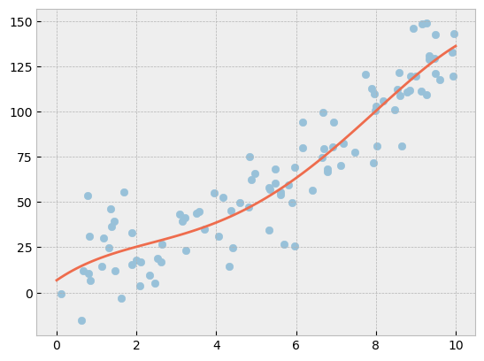

During my university years, I've had many courses on machine learning, and even specialized in it during my masters. To freshen up my knowledge, I decided to read a book on the subject.  I'm currently reading [*Deep Learning*](https://www.deeplearningbook.org/) by Ian Goodfellow, Yoshua Bengio and Aaron Courville. Throughout the next couple of blog posts, I'll be writing about the topics I read about in the book.

The first topic I'll be covering is linear regression.

## The linear regression model

Linear regression aims to predict a scalar *y* given a vector of inputs **x**. It does so through a linear combination of the inputs, a set of weights **w**, and a bias **b**.

$$y = w^T x + b$$

Or in matrix form, where **X** is the matrix of inputs (each column is a feature) and **y** is the vector of outputs:

$$y = X w + b$$

Note that **b** can be included in **X** by setting the first column of **X** to all ones.

## Finding the weights

In order to accurately predict the output, we need to find the weights **w** that minimize the error between the predicted output **ŷ** and the actual output **y**. The most common metric for measuring the error is the mean squared error (MSE):

$$MSE = \frac{1}{n} \sum_{i=1}^n (ŷ_i - y_i)^2$$

Or in matrix form:

$$MSE = \frac{1}{n} \| X w - y \|_2^2$$

To find the optimal weights, we need to find the values of **w** that minimize the MSE.

Since **1/n** is a constant, we can remove it and end up with the residual sum of squares:

$$J(w) = \|Xw - y\|_2^2 = (Xw - y)^T (Xw - y)$$

To minimize J and therefore also the MSE, we find the derivative of J with respect to w and set it to zero:

$$\frac{dJ}{dw} = -2X^T (Xw - y) = 0$$

This gives us the optimal weights:

$$w = (X^T X)^{-1} X^T y$$

The formula above is known as the normal equations.

## Rough Python implementation

Below a simple Python implementation of a variant of the linear regression model can be found. This variant is known as polynomial linear regression, where the weights resemble the coefficients of each polynomial.

$$y = w_0 + w_1 x + w_2 x^2 + w_3 x^3 + \dots + w_n x^n + \epsilon$$

To implement this, we first define our dataset **X** and target **y**. We let **y** be an arbitrary polynomial that we come up with and add some noise to it. **X** contains the values of **x** and its powers.

```python
import numpy as np

max_polynomial = 5

x = np.random.uniform(0, 10, 100)
X = np.array([x**n for n in range(0,max_polynomial)]).T

noise = np.random.normal(30, 30, 100)
y = 2*x + x*x+ 5 + noise

```

Now using the normal equations, we can find the optimal weights **w**.

```python
xTx = np.dot(np.transpose(X), X)
xTy = np.dot(np.transpose(X), y)
weights = np.dot(np.linalg.inv(xTx),xTy)

```

Finally, we plot the data and the polynomial we found.


<div class="img-container">

</div>

A Jupyter notebook containing the full code can be found <a href="./notebooks_linear_regression.ipynb" download>here</a>.