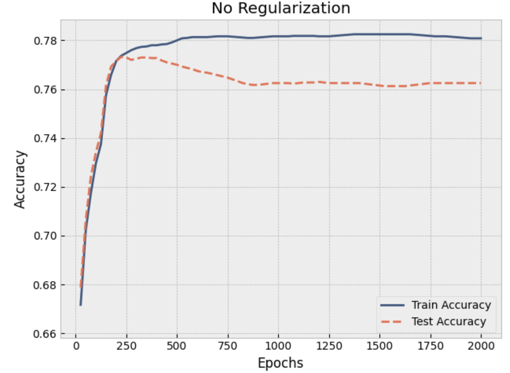
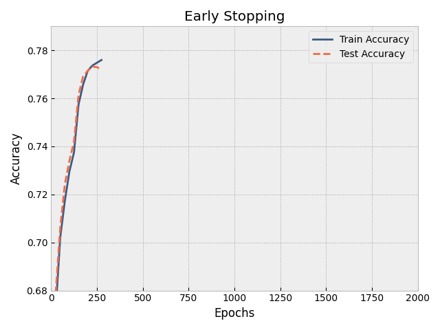






  
    
  
  
    
  
  
    
  


As we have seen in the previous post, overparameterized models can lead to overfitting the training data. This is particularly visible when we compare the training and test accuracy of the model throughout training. At first, both our training and test accuracy increase, but at some point the test accuracy starts to decrease while the training accuracy increases further and reaches a plateau. In our previous post we prevented this by adding a penalty term to the loss function. This post discusses another regularization technique that can be used to prevent overfitting.

<div class="img-container-big">

</div>

## Early stopping

One might look at the graph above and wonder "Why can't we just stop training around 250 epochs?". The answer is that we can, and that this is exactly what **early stopping** does. 

The early stopping algorithm is rather simple. It monitors the test accuracy throughout training. Once it finds a new optimum, it stores the accuracy and the corresponding weights. Whenever the test accuracy doesn't improve for $p$ epochs (also called patience), the algorithm stops the training and uses the optimal weights that it found earlier. 

If we reuse the model and data from the previous post, the early stopping algorithm can be implemented as follows.

```python
best_weights = None
best_acc = 0.0

patience = 5
no_improvement = 0

epochs = 2000
for epoch in range(epochs):
    if no_improvement >= patience:
        break
    
    model.train()
    outputs = model(X_train)
    loss = criterion(outputs, y_train)
    
    optimizer.zero_grad()
    loss.backward()
    optimizer.step()

    model.eval()

    # Track metrics every 25 epochs
    if (epoch + 1) % 25 == 0:
        model.eval()
        with torch.no_grad():
            _, train_predicted = torch.max(outputs, 1)
            train_acc = (train_predicted == y_train).sum().item() / y_train.size(0)
            
            test_outputs = model(X_test)
            _, test_predicted = torch.max(test_outputs, 1)
            test_acc = (test_predicted == y_test).sum().item() / y_test.size(0)

        if test_acc > best_acc:
            best_acc = test_acc
            best_weights = best_weights = copy.deepcopy(model.state_dict())
            no_improvement = 0
        else:
            no_improvement+=1
```

When we run this code, we see that training stops around 250 epochs and the optimal weights were found a couple of epochs earlier.

<div class="img-container-big">

</div>

## Is this the same as regularization?

To study the effect of early stopping on the weights of a Neural Network, we will take a look at the update rule that SGD applies to the weights. During SGD, the next set of weights $w^{(t)}$ are defined as follows:

$$w^{(t)} = w^{(t-1)} - \epsilon \nabla_w J(w^{(t-1)})$$

In the previous post we approximated the gradient of the loss function with a Taylor series and found that

$$\nabla_w \hat{J}(w) = H(w - w^{\star})$$

When we plug this into the update rule, we get

$$w^{(t)} = w^{(t-1)} - \epsilon H(w^{(t-1)} - w^{\star})$$

Which leads to 

$$ w^{(t)} - w^{\star} = \left( I - \epsilon H \right)\left( w^{(t-1)} - w^{\star} \right)$$

Similar to the previous post, we decompose the Hessian matrix $H$ into $Q\Lambda Q^T$ where $\Lambda$ is a diagonal matrix with the eigenvalues of $H$.

$$ w^{(t)} - w^{\star} = \left( I - \epsilon Q\Lambda Q^T \right)\left( w^{(t-1)} - w^{\star} \right)$$

$$ Q^T \left( w^{(t)} - w^{\star} \right) = \left( I - \epsilon \Lambda \right) Q^T \left( w^{(t-1)} - w^{\star} \right)$$

To further study the effect of early stopping, we will assume the weights are initialized at 0, $w^{(0)} = 0$.

First we break down the formula above into

$$ x^{(t)} = Q^T \left( w^{(t)} - w^{\star} \right) $$

$$ A = \left( I - \epsilon \Lambda \right) $$

Therefore our update rule becomes

$$  x^{(t)} = A x^{(t-1)} $$

And due to the recursion this is equivalent to

$$ x^{(t)} = A^t x^{(0)} $$

When we plug the original definitions of $x$ and $A$ into this equation, we get

$$ Q^T \left( w^{(t)} - w^{\star} \right) = \left( I - \epsilon \Lambda \right)^t Q^T \left( w^{(0)} - w^{\star} \right) $$

$$ = \left( I - \epsilon \Lambda \right)^t Q^T \left( 0 - w^{\star} \right) $$

$$ = - \left( I - \epsilon \Lambda \right)^t Q^T  w^{\star}  $$

Then this leads to

$$ Q^T w^{(t)} - Q^T w^{\star} = - \left( I - \epsilon \Lambda \right)^t Q^T  w^{\star} $$

$$ Q^T w^{(t)} = - \left( I - \epsilon \Lambda \right)^t Q^T  w^{\star} + Q^T w^{\star} $$

$$ = \left( I -  \left( I - \epsilon \Lambda \right)^t \right) Q^T  w^{\star} $$

## Relation to L2 regularization

In our previous post we found that the optimal weights for a L2 regularized model can be described by the following equation:

$$ \tilde{w} = Q \left( \Lambda + \lambda I \right)^{-1} \Lambda Q^T w^{\star}$$

Which can be rewritten as

$$ Q^T \tilde{w} = \left( \Lambda + \lambda I \right)^{-1} \Lambda Q^T w^{\star}$$

$$ = \left( I - (\Lambda + \lambda I)^{-1}\lambda \right) Q^\top w^*$$


Since this equation is very similar to the equation we found for early stopping, we can see that early stopping is equivalent to L2 regularization when the following holds:

$$ \left( I - \epsilon \Lambda \right)^t =  \left(\Lambda + \lambda I \right)^{-1}\lambda $$

Further derivation and approximation leads to finding

$$t \approx \frac{1}{\epsilon\lambda}$$

In other words, given a constant $\epsilon$, the early stopping epoch is inversely proportional to the learning rate $\alpha$. A longer training time therefore means in less regularization, and a shorter training time means in more regularization. This is exactly in line with the regularization effect of early stopping we saw earlier in this post.


A Jupyter notebook containing the full code can be found <a href="/files/notebook_early_stopping.ipynb" download>here</a>.