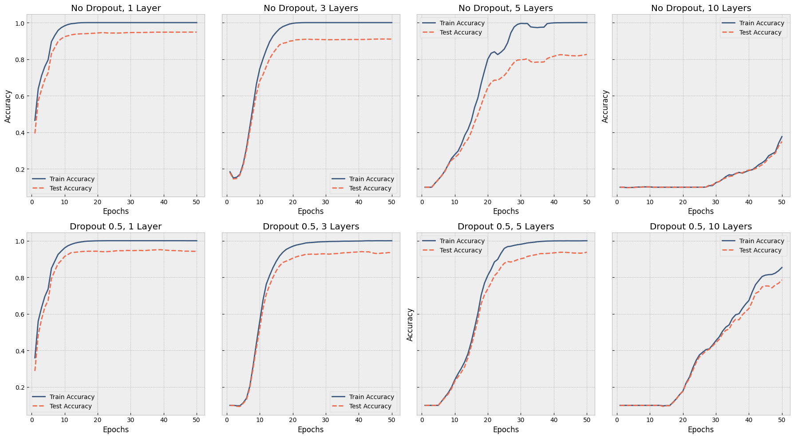






  
    
  
  
    
  
  
    
  


Ensemble methods like bagging and boosting are a way to combine multiple models to improve the performance of a model. These methods are considered a form of regularization, as the combination of different models result in less variance in the error, especially when the errors of the individual models are not correlated. 

While good for performance, these methods usually come with a higher computational cost, caused by the overhead of training multiple models. This is especially true when we are trying to train multiple large neural networks.

Dropout is a technique that approximates an ensemble of multiple neural networks. This approximation comes at almost no additional computational cost, and allows for scaling to an exponential number of models. In this post we will discuss the basics of dropout, and show how it can be used to improve the performance of neural networks.

## The dropout algorithm

Dropout works by randomly dropping out a fraction of the neurons in a layer during training. It does so by creating mask of 1s and 0s, where 1 means that the neuron is kept, and 0 means that the neuron is dropped. The mask is then multiplied with the weights of the neurons, and the result is used as the input to the next layer. This is illustrated in the graph below.

Randomly dropping out of neurons basically creates variations of the model. When our model has $n$ different neurons, we are basically sampling from the $2^n$ possible variations of the model. Our final model is therefore an pseudo-ensemble of these different models.

<!DOCTYPE html>
<html lang="en">
<head>
<meta charset="UTF-8">
<title>Neural network dropout visualization</title>
<style>
  body {
    font-family: -apple-system, Segoe UI, Helvetica, Arial, sans-serif;
    max-width: 640px;
    margin: 40px auto;
    padding: 0 16px;
    color: #222;
  }
  .controls {
    display: flex;
    align-items: center;
    gap: 12px;
    margin-bottom: 16px;
  }
  .controls label {
    font-size: 14px;
    color: #555;
  }
  #rate {
    flex: 1;
  }
  #rate-out {
    font-size: 14px;
    font-weight: 600;
    min-width: 32px;
  }
  button {
    width: 100%;
    padding: 8px 12px;
    font-size: 14px;
    border: 1px solid #ccc;
    border-radius: 6px;
    background: #fff;
    cursor: pointer;
    margin-bottom: 16px;
  }
  button:hover {
    background: #f5f5f5;
  }
  svg {
    width: 100%;
    height: auto;
    display: block;
  }
  #caption {
    font-size: 13px;
    color: #666;
    text-align: center;
    margin-top: 8px;
  }
</style>
</head>
<body>

<div class="controls">
  <label for="rate">Dropout rate (p)</label>
  <input type="range" min="0" max="0.8" step="0.1" value="0.4" id="rate">
  <span id="rate-out">0.4</span>
</div>

<button id="resample">Resample</button>

<svg id="net" viewBox="0 0 600 280" role="img" aria-label="Network diagram showing active and dropped units"></svg>

<script>
(function () {
  const svg = document.getElementById('net');
  const rateInput = document.getElementById('rate');
  const rateOut = document.getElementById('rate-out');
  const resampleBtn = document.getElementById('resample');
  const caption = document.getElementById('caption');

  // Network architecture: input layer, two hidden layers, output layer
  const layers = [3, 5, 5, 2];
  const xs = [60, 220, 380, 540];

  let rate = 0.4;
  let mask = [];

  // Randomly decide which hidden units are dropped this pass.
  // Input and output layers are never dropped.
  function genMask() {
    mask = layers.map((n, li) => {
      if (li === 0 || li === layers.length - 1) return new Array(n).fill(true);
      return new Array(n).fill(0).map(() => Math.random() >= rate);
    });
  }
  genMask();

  function nodePos(li, ni) {
    const n = layers[li];
    const spacing = 240 / n;
    const y = 20 + spacing / 2 + ni * spacing;
    return [xs[li], y];
  }

  function render() {
    let svgContent = '';

    // Draw connections first (so nodes sit on top)
    for (let li = 0; li < layers.length - 1; li++) {
      for (let ni = 0; ni < layers[li]; ni++) {
        for (let nj = 0; nj < layers[li + 1]; nj++) {
          const [x1, y1] = nodePos(li, ni);
          const [x2, y2] = nodePos(li + 1, nj);
          const active = mask[li][ni] && mask[li + 1][nj];
          const stroke = active ? '#999' : '#ddd';
          const opacity = active ? 0.7 : 0.15;
          svgContent += `<line x1="${x1}" y1="${y1}" x2="${x2}" y2="${y2}" stroke="${stroke}" stroke-width="1" opacity="${opacity}" />`;
        }
      }
    }

    // Draw nodes
    for (let li = 0; li < layers.length; li++) {
      for (let ni = 0; ni < layers[li]; ni++) {
        const [x, y] = nodePos(li, ni);
        const isIO = li === 0 || li === layers.length - 1;
        const dropped = !mask[li][ni] && !isIO;

        if (dropped) {
          // Dropped unit: dashed outline, faded
          svgContent += `<circle cx="${x}" cy="${y}" r="14" fill="none" stroke="#ddd" stroke-width="1" stroke-dasharray="3,3" opacity="0.25" />`;
        } else if (isIO) {
          // Input/output unit: neutral fill
          svgContent += `<circle cx="${x}" cy="${y}" r="14" fill="#f0f0f0" stroke="#aaa" stroke-width="1" />`;
        } else {
          // Active hidden unit
          svgContent += `<circle cx="${x}" cy="${y}" r="14" fill="#9FE1CB" stroke="#1D9E75" stroke-width="1" />`;
        }
      }
    }

    svg.innerHTML = svgContent;
  }

  rateInput.addEventListener('input', (e) => {
    rate = parseFloat(e.target.value);
    rateOut.textContent = rate.toFixed(1);
    genMask();
    render();
  });

  resampleBtn.addEventListener('click', () => {
    genMask();
    render();
  });

  render();
})();
</script>

</body>
</html>

## Training

The dropping of weights only happens during training. We perform a forward pass by multiplying the inputs of each layer with the weights of each layer multiplied with the dropout mask. The formula below describes how this works for a simple linear model. Here $\mathbf(m)$ is the dropout mask, and $\odot$ is the element-wise multiplication.

$$y = \mathbf{w} \cdot (\mathbf{x} \odot \mathbf{m}) + b$$

Backpropagation is performed in the same way as for non-dropout networks, except that the gradient of the loss function with respect to the weights is multiplied with the dropout mask. The gradient with respect to $w$ is therefore

$$\frac{\partial y}{\partial \mathbf{w}} = \mathbf{x} \odot \mathbf{m}$$

Once the model is trained, we remove the dropout mask.

## Inference

Ensemble methods usually perform inference by averaging the predictions of the individual models. When we use dropout, the various models are more or less part of the same ensemble model. As we don't use a dropout mask during inference, we are essentially summing the predictions of all the models.

As these models were trained with only a fraction of the neurons active, this sum-like operation results in predictions that are not in line with the predictions of the sub models. To counter this, we can scale the outputs by $\frac{1}{1-p}$ to match the scale of the predictions of the sub models. Another common way is to apply this scaling during training.


## Dropout in action

First we define a simple Dropout layer that can be used on top of any existing layer.
This layer basically creates a random mask of 0s and 1s, based on the dropout probability $p$.
Finally it multiplies the input by the mask, and divides by the scaling factor $1/(1-p)$.

```python
class DropoutLayer(nn.Module):
    def __init__(self, p=0.5):
        super().__init__()
        self.p = p

    def forward(self, x):
        if not self.training or self.p == 0.0:
            return x
        mask = (torch.rand_like(x) > self.p).float()
        return x * mask / (1 - self.p)

```

We test out the effect of dropout on the MNIST numbers dataset, containing images of handwritten digits.
We will shrink the original dataset, so that the model is more likely to overfit the training data.

We define the model as follows:
```python

model = nn.Sequential(
      nn.Conv2d(1, 64, kernel_size=3, padding=1),
      nn.ReLU(),
      nn.MaxPool2d(2, 2),
      DropoutLayer(p=conv_dropout_rate),

      nn.Conv2d(64, 128, kernel_size=3, padding=1),
      nn.ReLU(),
      nn.MaxPool2d(2, 2),
      DropoutLayer(p=conv_dropout_rate),

      # n of these layers:
      nn.Linear(6272, 6272),
      nn.ReLU(),
      DropoutLayer(p=dropout_rate),

      nn.Flatten(),
      nn.Linear(6272, 1024),
      nn.ReLU(),
      DropoutLayer(p=dropout_rate),
      
      nn.Linear(1024, 10)
    )
```

Notice that we have added our custom dropout layer after each convolutional layer and after each fully connected layer.
We use a lower dropout rate for the convolutional layers, and a higher dropout rate for the fully connected layers.

As the effect of dropout is most noticeable when we are working with deeper networks combined with small datasets, we show the effects of dropout on a small dataset combined with various network sizes.

We train the model on the MNIST dataset, having 100 samples per class, so a total of 1000 samples. We train the model both with and without dropout (p=0.5) for 1-layer, 3-layer, 5-layer and 10-layer configurations. The results of this experiment can be found below.

<div class="img-container-big">

</div>

We can see that on the 1-layer network, the dropout rate of 0.5 has no effect on the training accuracy. However, once our models get deeper, the effect of dropout becomes more pronounced. Both the 3-layer and 5-layer networks have much higher test accuracy compared to their non-dropout counterparts. For the 10-layer network, the network is even more pronounced, the model without dropout is almost not able to train at all within the given 50 epochs, whereas the model with dropout gets to a decent accuracy, almost two times better than the non-dropout model.

A Jupyter notebook containing the full code can be found <a href="/files/notebook_dropout.ipynb" download>here</a>.