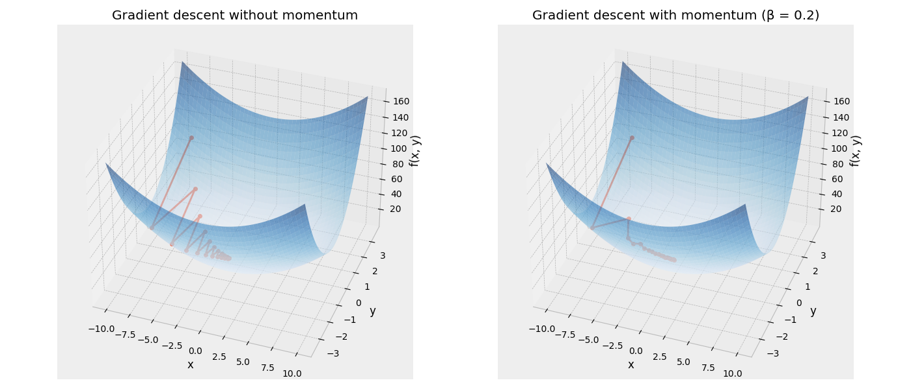

Before we focus on this posts's subject, we will first take a small detour and discuss physics.

Newtons's second law of motion states that the acceleration of an object is directly proportional to the net force acting on it and inversely proportional to its mass. This can be expressed mathematically as:

$$ m\ddot{x}(t)=F(x) $$

Where $m$ is the mass of the object, $\ddot{x}$ is the acceleration of the object, and $F(x)$ is the net force acting on the object.

Given a ball of mass $m$ rolling down a slope, $F$ can be broken down into two components: the gravity $F_{grav}$ that pulls the ball down the slope and the friction* $F_{fric}$ that opposes the motion of the ball.

This gives us the following equation:

$$ m\ddot{x}(t)=F_{grav}(x)-F_{fric}(x) $$

Given the slope of the surface at any point is defined by the gradient $\nabla f(x)$ and the friction can be defined as a coefficient $\mu$ multiplied by the velocity $\dot(x)$ of the ball:

$$ m\ddot{x}(t)= - \nabla f(x) - \mu\dot{x}(t) $$

Using the finite differences of $\dot{x}$ and $\ddot{x}$ we can discretize the equation above:

$$ x_{t+1} = x_t + \left(1 - \frac{\mu h}{m}\right)(x_t - x_{t-1}) - \frac{h^2}{m}\\nabla f(x_t) $$

$$ x_{t+1} = x_t + \beta\ (x_t - x_{t-1}) - \eta\ \nabla f(x_t) $$

Here $\beta$ controls how much a previous speed contributes to the downhill movement. As we have seen in the formula above, less friction usually means more momentum and the opposite way around.

This interaction between the ball, the surface and the momentum is visualized in the graph below. Note that once we increase momentum, the ball will converge faster to the lowest point of the surface. This is of course also a property of a good optimization algorithm.




## Momentum for Gradient Descent

In Polyak's 1964 paper "Some methods of speeding up the convergence of iteration methods" he introduces a method that speeds up the convergence of gradient descent, analogous to the physics of momentum described above. In his paper he therefore coined this method "the method of a small heavy sphere". Nowadays, more often referred to as the "heavy ball method".

As we have seen before, a gradient descent step that updates the network weights $\theta$ is defined as:

$$ \theta_{t+1} = \theta_t - \alpha\ \nabla L(\theta_t) $$

Polyak's paper proposes to add a second term to te gradient step, based on the previous two sets of weights.

$$ \theta_{t+1} = \theta_t - \alpha\ \nabla L(\theta_t) + \beta (\theta_{t} - \theta_{t-1}) $$

Note that this is pretty much identical to the discrete function we have derived above from the second law of motion. The term that Polyak adds is the analogue of the momentum term in the physics equations above that is proportional to the velocity.

Instead of updating the weights directly, it is more common to have a intermediary variable $ v_t = \theta_t - \theta_{t-1} $ that resembles the velocity instead. 

$$ v_{t+1} = \beta v_t - \alpha\ \nabla L(\theta_t) $$

$$ \theta_{t+1} = \theta_t +  v_{t+1} $$

Similar to the physics analogue, SGD with momentum tends to converge faster. Another nice property of this method is that it smooths out any oscillations in the gradient descent algorithm. As vanilla gradient descent only looks at the slope of the current gradient, it tends to overshoot and oscillate. Momentum, on the other hand, takes into account the velocity of the previous steps and therefore smoothes out the oscillations. 

An example of these benefits will be illustrated in the next section.

## Python implementation

Using the update formulas above, we can rewrite the gradient descent algorithm in Python as follows:

```python
def gradient_descent(start, lr=0.09, beta=0.0, steps=20):
    pos = np.array(start, dtype=float)
    velocity = np.zeros(2)
    for _ in range(steps):
        velocity = beta * velocity - lr * grad(*pos)
        pos = pos + velocity
```

We run gradient descent on a bowl-like problem surface with and without momentum. We can clearly see that the non-momentum version of the algorithm oscillates quite a bit. Once we add momentum by increasing the $\beta$ parameter, the algorithm converges more quickly and also much more smoothly.

<div class="img-container-big">

</div>


A Jupyter notebook containing the full code can be found <a href="/files/notebook_momentum.ipynb" download>here</a>.

$*$ For the sake of example, we will assume that the friction is viscous. 