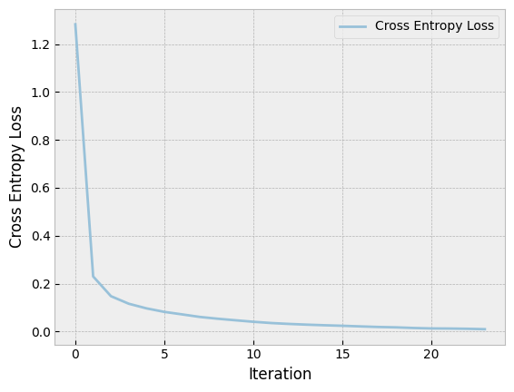
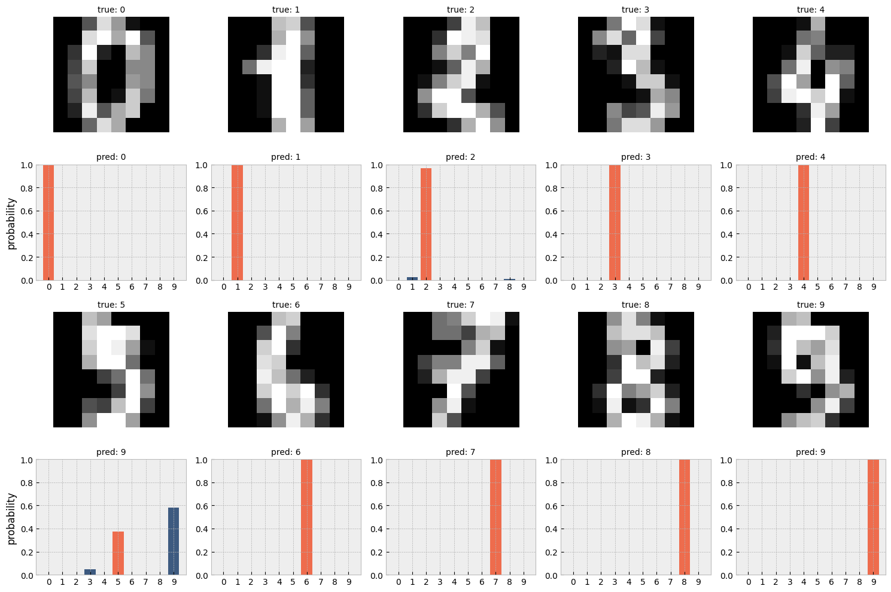

So far, we have only discussed networks that are trained on data that is 1-dimensional and independent of order.
Meaning that is does not matter if we swap the first and second feature, the model will still learn the same weights.

Image data on the other hand is 2-dimensional (or even three-dimensional if we have channel to represent color). This data is also ordered, meaning that the position of the feature is important. Swapping the position of features will mess up the image. 

Regular neural networks are (or were) not well suited for this kind of data:
- A reasonably sized image can easily contain millions of features (pixels), if we were to add a fully connected layer on top of this, we would easily have a model with hundreds of millions of parameters. Especially in early days of neural networks, this was a major limitation.
- Regular neural network don't have a notion of spatial relationships between features. The weights in a fully connected layer don't have spatial information by default, and therefore can't be used to learn spatial relationships.
- In many image recognition tasks, we don't care where a certain object is in the image, we just care about it's presence. This raises the question if it makes sense to learn separate weights for each pixel in the image. We would need to learn very similar features for each pixel, which would for some part be a waste of computational resources.

Convolutional Neural Networks aimed to solve these problems by incorporating a layer of so-called Convolutions into the network. These convolutions are 2D (or higher dimensional) sets of weights (kernels) that are applied to the image in a window-like fashion. As they are not flat, they can be used to learn spatial relationships between features. Similarly their sliding behaviour allows them to share weights between different parts of the image, therefore becoming invariant to position. And finally, since we reuse weights across many different pixels, we can also greatly reduce the number of parameters in the network.

A single-channel convolution is defined as follows:

$$ Y_{i,j} = \sum_{m=0}^{K-1} \sum_{n=0}^{K-1} X_{(i \cdot S + m),\,(j \cdot S + n)} \cdot W_{m,n} + b $$

In this formula, $Y_{i,j}$ is the output value at position $(i,j)$ in the feature map; $X$ is the input image, indexed by row and column position. $W$ is the kernel, a matrix of $K \times K$ learnable weights. $W$ slides across the input for each $i$ and $j$. On top of that there is $S$, which is the stride, allowing us how far the kernel should slide across the input in every step. And finally $b$ is a bias term that is added to the output.

This sliding behaviour is visually illustrated in the animation below.



Multiple convolutions are usually combined into a single layer, allowing us to learn multiple features at once. In addition to that it is also possible to stack multiple convolutioal layers on top of each other, allowing us to learn more complex/higher-level features. An example of a simple convolutional neural network is shown below.



Now that we understand the basics of convolutional neural networks, lets go build our own!

## Building a simple convolutional neural network

To build a simple convolutional neural network, we will extend the Deep Learning library we have built in a previous post.

We first define a simple `Kernel` class that defines each of the kernels in our convolutional layer. This class contains the $K \times K$ weight matrix $W$ and a bias term $b$. We keep the weight matrix flat so we can use vector multiplication with parts of the input image.

```python
class Kernel:
    def __init__(self, kernel_size: int):
        self.kernel_size = kernel_size

        # # Keeping kernel flat so we can use @
        self.W = Tensor(np.random.randn(kernel_size*kernel_size, 1))
        self.b = Tensor(np.zeros((1, 1)))

    def apply(self, x: Tensor) -> Tensor:
        flat_x = x.flatten()
        return flat_x @ self.W + self.b

    def parameters(self) -> list:
        return [self.W, self.b]
```

Next, we define a `Conv2D` class* that defines a single convolutional layer. This class takes in a number of kernels and a kernel size. Once called it applies each of the kernels to the input tensor by sliding over it and summing the results.
In order to keep track of the backpropagation, we store the backpropagation functions for each kernel in a list. When backpropagation calls `_back` on the `Conv2D` class, it will call each of these functions so that the gradients can be calculated.

```python
class Conv2D:
    def __init__(self, kernel_count: int, kernel_size: int):
        self.kernel_count = kernel_count
        self.kernel_size = kernel_size
        self.kernels = [Kernel(kernel_size) for _ in range(kernel_count)]

    def __call__(self, x: Tensor) -> Tensor:
        output_size_x = x.data.shape[0] - self.kernel_size + 1
        output_size_y = x.data.shape[1] - self.kernel_size + 1

        out = Tensor(np.zeros((output_size_x, output_size_y, self.kernel_count)))
        out_backs = []

        # We will assume the input image is 2D for now as well.
        for i in range(output_size_x):
            for j in range(output_size_y):
                image_slice = x[i:i+self.kernel_size, j:j+self.kernel_size]
                for k, kernel in enumerate(self.kernels):
                    y = kernel.apply(image_slice)
                    out_backs.append(y._back)
                    out.data[i, j, k] += y.data

        def _back():
            for back in out_backs:
                back()

        out._back = _back
        return out
```

Now that we have defined our convolutional layer, we can combine it with the previously defined layers and the `Sequential` class to build a full neural network.

```python
model = Sequential(
    Conv2D(3, 3),
    Flatten(),
    Linear(108, 10),
    ReLU(),
    Linear(10, 10),
    Flatten()
)
```

In this case we have a convolutional layer with 3 kernels, each with a kernel size of 3. The outputs of these convolutions are then flattened and then passed through two linear layers before producing an output.


We will train this model on the `digits` dataset from the `sklearn` library. This dataset is a simpler version of the MNIST dataset. It contains 1797 images of handwritten digits, with each image being 8x8 pixels.

```python
from sklearn.datasets import load_digits

digits = load_digits()

reshaped_data = digits.data.reshape(1797, 8, 8)

X = Tensor(reshaped_data)
Y = Tensor(digits.target) 
```

Finally we train the model using the cross-entropy loss function and backpropagation.

```python
for epoch in range(1, 25):
        ces = np.array([])
        for x, y in zip(X.data, Y.data):
            inp    = Tensor(x)
            target = Tensor([[y]])
            pred   = model(inp)
            ce = cross_entropy(pred, int(y))

            # Clear gradients from previous epoch.
            model_params = model.parameters()
            for p in model_params:
                p.grad = np.zeros_like(p.data)

            # Calculate new gradients.
            ce.backward()

            # Update weights.
            for p in model_params:
                p.data -= 0.05 * p.grad
```

We trained the model for 25 iterations. After which, the cross-entropy loss has decreased to roughly 0.01.

<div class="img-container-big">

</div>

To verify that the model actually learned to identify the digits, we plot the first few digits of the dataset together with the model's predicted probabilities for each digit. The model was able to identify almost all of the digits correctly. The one it misclassified, still had a relatively high probability for the correct class. The image for this case is also rather vague, even for a human it's unclear if this is a 5 or a 9. Potentially better results can be achieved with longer training times or different model architectures.

<div class="img-container-big">

</div>


A Jupyter notebook containing the full code can be found <a href="/files/notebook_cnns.ipynb" download>here</a>.

<div class="footnote">
$*$ This implementation is for illustrative purposes. It's far from efficient.
</div>