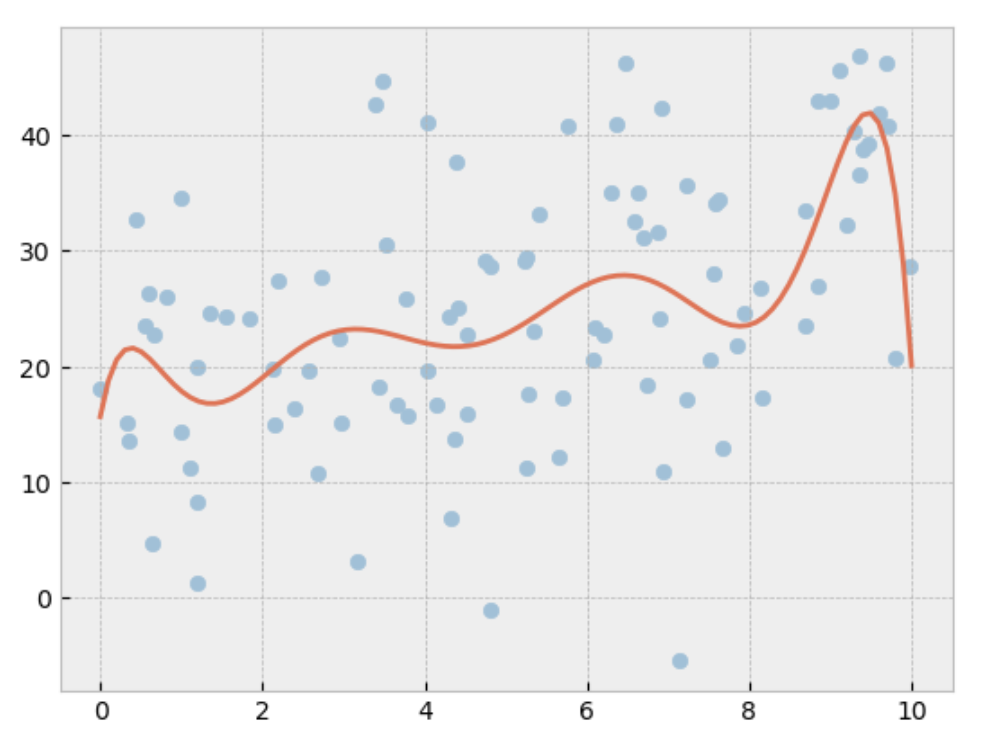




  
    
  


In the previous post, we discussed <a href="{{ linearRegressionPost }}">Linear Regression</a> and implemented a simple variant of it in Python. When we increase the number of polynomials, the resulting model becomes increasingly complex, even when the true underlying function is simple. Below you can see data coming from the function $y = 2x + 5$ . The optimal weights however result in a very complex model that clearly overfits the training data.

<div class="img-container">
    
</div>

When inspecting the weights of the model, we find that the optimal weights that were found by the linear regression algorithms are very large, especially compared to the function $y = 2x + 5$ that created the data.

```python
>>> weights
array([ 1.56753280e+01,  3.85287994e+01, -8.31689769e+01,  7.06624600e+01,
       -3.00112062e+01,  7.08036835e+00, -9.56975847e-01,  7.20111167e-02,
       -2.68660948e-03,  3.48744165e-05])
```

## Regularization

To counter this effect, we can add a regularization term to the loss function $J$. This term will punish the model for having large weights. There are many different regularization techniques, but for now we will focus on L2 regularization. The combination of L2 regularization and linear regression is known as **Ridge regression**.

As can be seen in the formula below, we combine the MSE with the L2 norm of the weights together with a small constant $\lambda$. As $\lambda$ increases, the model will be penalized more for having large weights.

$$J(w) = MSE + \lambda \| w \|_2^2$$

We can rewrite the loss function as follows:

$$J(w) = \|y - Xw\|^2 + \lambda \|w\|^2$$
$$ = (y - Xw)^T(y - Xw) + \lambda w^T w$$
$$ = y^T y - 2w^T X^T y + w^T X^T X w + \lambda w^T w$$

Similar to regular linear regression, we can find the optimal weights by finding the derivative of the loss function with respect to w and set it to zero.

$$\nabla_w J(w) = -2X^T y + 2X^T X w + 2\lambda w = 0$$
$$w = (X^T X + \lambda I)^{-1} X^T y$$

Now lets implement this in Python and see if it improves the model.

## Rough Python implementation

Again, we will start with a artificially created dataset based on the function $y = 2x + 5$.

```python
x = np.random.uniform(0, 10, 100)
X = np.array([x**n for n in range(0,max_polynomial)]).T
noise = np.random.normal(10, 10, 100)
y = 2*x + 5 + noise
```

Using the normal equations we have derived above, we can find the optimal weights.

```python
xTxli = np.dot(np.transpose(X), X) + np.identity(max_polynomial) * lamb
xTy = np.dot(np.transpose(X), y)
weights_ridge = np.dot(np.linalg.inv(xTxli),xTy)
```

When inspecting the weights of the model, we can already see that the optimal weights are much smaller than the weights we found by the linear regression algorithm.

```python
>>> weights_ridge
[ 2.30967989e+00  1.72792277e+00  1.56380518e+00  1.26149762e+00
  3.68017212e-01 -7.85619386e-01  2.80765536e-01 -4.40249214e-02
  3.26573485e-03 -9.36270593e-05]
```

Below we have plotted the polynomial that both the linear regression and ridge regression model have found.
While Ridge regression is still overfitting the data, it seems to bend more towards the true underlying function.
We can consider increasing lambda to get an even better fit. 

<div class="img-container">

</div>


A Jupyter notebook containing the full code can be found <a href="/files/notebook_ridge_regression.ipynb" download>here</a>.

