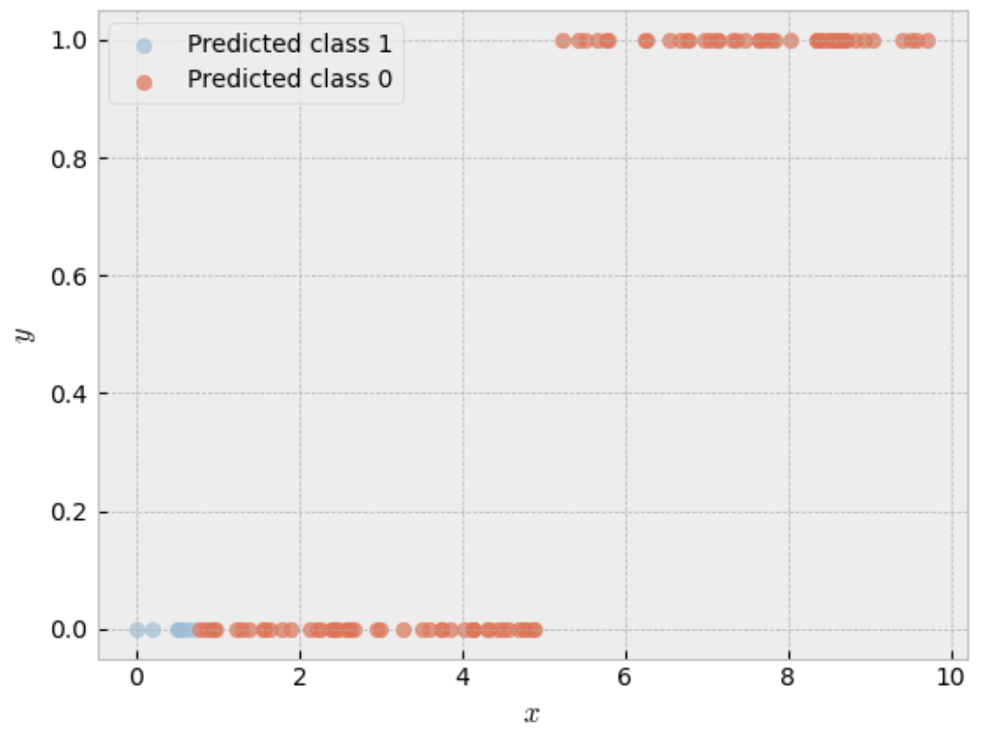
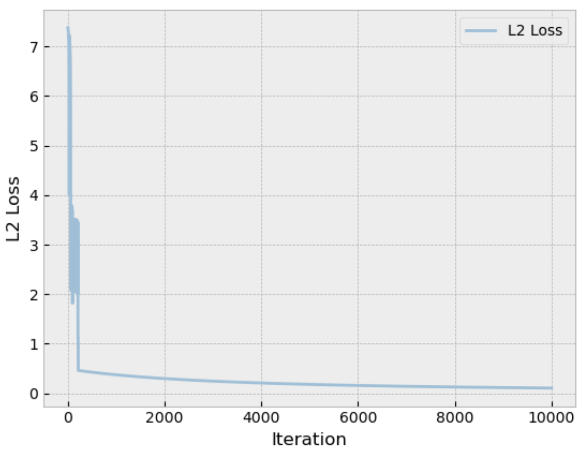
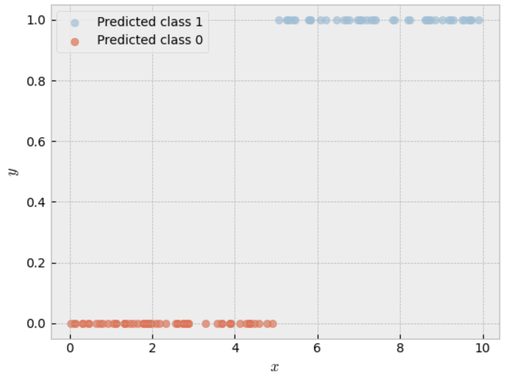






  
    
  
  
    
  
  
    
  


Due to certain limitations, Linear Regression cannot be directly used to solve classification problems. Most notably, it's output is not guaranteed to be within a certain interval (e.g. $[0,1]$).

We can however modify the Linear Regression model to make it suitable for (binary) classification problems. We do this by wrapping the linear regression model with a sigmoid function. As the sigmoid function has a range of [0,1], we guarantee that the model's outputs are as well. This model can then be used as the probability parameter of a Bernoulli distribution. The model we end up with is known as the **Logistic Regression** model.

$$ y_i \sim Bernoulli(p_i)  \quad \text{where} \quad p_i = \sigma(\theta^Tx_i) $$

Similar to other models, we can use the MLE to find suitable weights.

## Deriving the negative log likelihood

Again, we define the negative log-likelihood function as:


$$J(\theta) = -\sum_{i=1}^n \log P(y_i \mid x_i; \theta)$$
$$ = -\sum_{i=1}^n \log \left( p_i^{y_i} (1 - p_i)^{1 - y_i} \right)$$
$$ = -\sum_{i=1}^n \left[ y_i \log(p_i) + (1 - y_i) \log(1 - p_i) \right]$$

We now find the gradient of the (negative) log-likelihood with respect to $\theta$.

$$ \nabla_\theta J = \frac{\partial}{\partial \theta} -\sum_{i=1}^n \left[ y_i \log(p_i) + (1 - y_i) \log(1 - p_i) \right] $$

We apply the chain rule where $p_i = \sigma(z_i)$ and $z_i = \theta^T x_i$.

$$\nabla_\theta J = \frac{\partial J}{\partial p_i} \cdot \frac{\partial p_i}{\partial z_i} \cdot \frac{\partial z_i}{\partial \theta}$$

$$\nabla_\theta J = -\left( \frac{y_i}{p_i} - \frac{1 - y_i}{1 - p_i} \right) \cdot \left( p_i(1 - p_i) \right) \cdot x_i$$
$$\nabla_\theta J = -\left( \frac{y_i(1 - p_i) - p_i(1 - y_i)}{\cancel{p_i(1 - p_i)}} \right) \cdot \cancel{p_i(1 - p_i)} \cdot x_i$$
$$\nabla_\theta J = -(y_i - y_i p_i - p_i + y_i p_i)x_i$$
$$\nabla_\theta J = -(y_i - p_i)x_i = (p_i - y_i)x_i$$
$$\nabla_\theta J = (\sigma(w^Tx_i) - y_i)x_i$$

## Optimizing the weights

In contrast to the linear regression model, we cannot algebraically derive the weights $\theta$ that maximize the likelihood since $\nabla_\theta \ell = 0$ is not solvable due to the sigmoid term.

Instead, we will take a numerical approach and use gradient descent to find the optimal weights.

We define the gradient descent like this:

$$\theta^{(next)} = \theta^{(old)} - \alpha \nabla_\theta \ell(\theta)$$

Where $\alpha$ is the learning rate that determines how fast the weights are updated.

## Rough Python implementation

Let us first define our dataset. We will generate a dataset with 100 datapoints, with randomly distributed x values. The class y will be based on whether the x value is greater than 5. Ideally, our model should learn this relation between x and y.

```python
x = np.random.uniform(0, 10, 100)
noise = np.random.normal(0.5, 0.5, 100)
y = (x > 5).astype(int)
```

Similar to Polynomial Regression, we define matrix X, that contains the values of x and its powers.
We also define the weights w, which we will initialize using a standard normal distribution.
Finally, we compute the initial predictions y_pred.

```python
max_polynomial = 5

X = np.array([x**n for n in range(0,max_polynomial)]).T
w = np.random.standard_normal((max_polynomial))
y_pred = sigmoid(np.dot(X,w))

```

To get a sense of how our initial predictions look, we can plot the data and the predictions.


<div class="img-container">

</div>

TODO: Add line on how well the model is performing.

Now we use gradient descent to find more optimal weights. For each iteration, we compute the gradient of the loss function we derived earlier. We will then subtract the gradient multiplied by the learning rate from the weights so that we move closer to the minimum of the loss function.

```python
learning_rate = 0.0005

for i in range(10000):
    gradient = np.dot(X.T,(y_pred - y))
    w = w - (gradient*learning_rate)
    y_pred = sigmoid(np.dot(X,w))

```

When calculating the L2 error (`np.linalg.norm(y_pred - y)`) for each iteration, we can get a sense of how well the model is converging to the optimal weights. In the graph below we can clearly see that the model improved in the first few iterations, and then reached a plateau.

<div class="img-container">

</div>

Now lets use the weights we found to predict the class of each datapoint. 

<div class="img-container">

</div>

Clearly we can see that the logistic regression model learned the relation between x and y, and is using that to correctly classify each data point.

A Jupyter notebook containing the full code can be found <a href="/files/notebook_logistic_regression.ipynb" download>here</a>.
