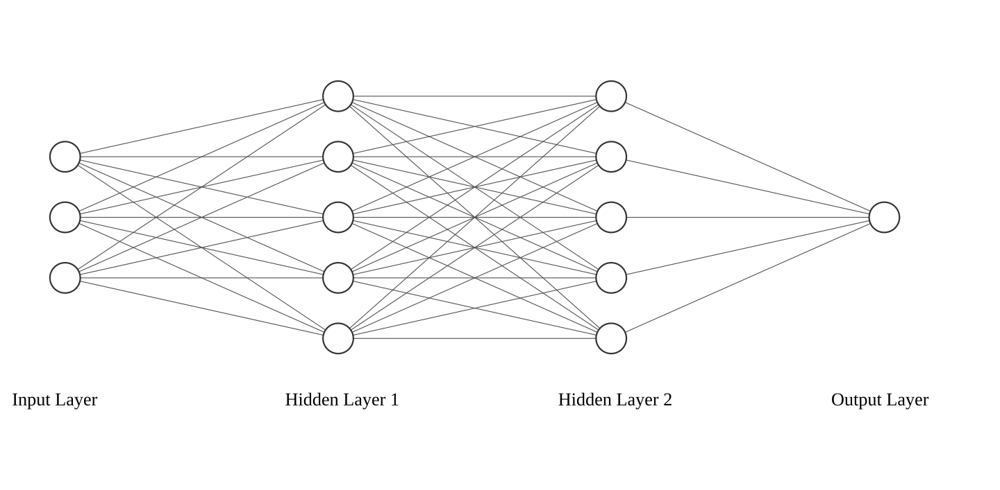






  
    
  
  
    
  
  
    
  


In previous posts we discussed <a href={{linearRegressionPost}}>linear regression</a> and some of its variations. As the name already suggests, linear regression is a model that assumes that the relationship between the input and output is linear.

$$y = w^T x + b$$


Since linear models assume linearity, they are not suitable for non-linear problems.

## XOR Problem

One example of a problem that requires learning a non-linear relationship is the XOR problem. The truth table for the XOR problem is shown below.

<table>
<tr>
<th>x1</th>
<th>x2</th>
<th>x1 XOR x2</th>
</tr>
<tr>
<td>0</td>
<td>0</td>
<td>0</td>
</tr>
<tr>
<td>0</td>
<td>1</td>
<td>1</td>
</tr>
<tr>
<td>1</td>
<td>0</td>
<td>1</td>
</tr>
<tr>
<td>1</td>
<td>1</td>
<td>0</td>
</tr>
</table>

Lets try to fit a linear model to this problem.

```python
X = np.array([[0, 0],
              [0, 1],
              [1, 0],
              [1, 1]])

# Add a row of 1s for bias.
X = np.c_[X, np.ones(X.shape[0])]

y = np.array([[0], 
              [1], 
              [1], 
              [0]])

# Solve normal equations
xTx = np.dot(np.transpose(X), X)
xTy = np.dot(np.transpose(X), y)
weights = np.dot(np.linalg.inv(xTx),xTy).round(2)
```

When printing the weights and predictions on the truth table we can see that our linear model assigned 0 to all variable weights and 0.5 to the bias. Because of this, the model predicts 0.5 for all inputs, which obviously does not match the truth table.

```python
>>> weights
weights: [[0. ]
 [0. ]
 [0.5]]

>>> np.dot(X, weights)
[[0.5]
 [0.5]
 [0.5]
 [0.5]]
```

The reason for this is that the XOR problem is a non-linear problem. The data points in the truth table are not linearly separable.

The linear model above, can however be extended to learn more complex relationships between the input and output. This is where neural networks come in.


## Neural Networks

Neural Networks consist of nodes that combine the linear model above with a non-linear activation function. These networks usually have multiple hidden layers that consist of many of these nodes, allowing the model to learn more complex relationships. The **Universal Approximation Theorem** even proves that a neural network with a single hidden layer when given enough nodes can approximate any continuous function.

Such networks usually consist of input nodes, hidden nodes and output nodes. The input nodes are the nodes that receive the input data, the hidden nodes are the nodes that learn the relationship between the input and output, and the output nodes are the nodes that output the result of the model. This is visualized in the following figure.


<div class="img-container">

</div>

Each of these layers is defined like this:
- The input layer receives the input data $x$, no transformations are applied to it.
- Each node $i$ in the hidden layer multiplies each input that it receives with the corresponding weight. It then sums the results together and applies an activation function to the result. This can be described by the following equation: $h_i = g(w_i^Tx + b_i)$ where $g$ is the activation function. When we generalize this to the whole layer, we get the following equation: $h = g(W^Tx + b)$.
- The output layer usually also applies a linear transformation to the data it receives from the final hidden layer. Depending on the problem, a activation function might be applied to the result as well. However for regression problems, the output layer does not apply an activation function and can be described by the following equation: $\hat{y} = W^Th + b$.

## Inference

We will cover how to find the optimal weights for a neural network in the next post. For now, we will assume that we have found the weights and that we can use them to predict the output of the model.

To make a single prediction, we will first compute the output of the first hidden layer.

$$ a^{(1)} = g(W^{(1)T}x + b^{(1)}) $$

Similarly we will compute the output of the second hidden layer by taking the output of the first hidden layer.

$$ a^{(2)} = g(W^{(2)T}h^{(1)} + b^{(2)}) $$

And finally we compute the output of the output layer.

$$ a^{(3)} = \hat{y} = W^{(3)}h^{(2)} + b^{(3)} $$

## Solving the XOR Problem using a Neural Networks

Now lets define a neural network that can solve the XOR problem. We will use a simple network that has one hidden layer with two nodes. We will use the ReLU action function for the hidden layer.

This network can be defined as follows:
```python
def relu(x):
    return np.maximum(0, x)

# Hidden layer 1 (2 inputs, 2 nodes)
W_h1 = np.random.randn(2, 2)
b_h1 = np.zeros(2)

# Output layer (2 inputs, 1 output)
W_o = np.random.randn(2,1)
b_o = np.zeros(1)
```

And inference can be done as follows:
```python
h1 = relu(np.dot(X, W_h1) + b_h1)
y_hat = np.dot(h1, W_o) + b_o
```

When we run this code, we will see that our predictions are clearly not the same as the truth table. This is because we initialized the weights randomly. We will need to find the optimal weights for this network in order to solve this problem.

```python
>>> y_hat
array([[ 0.        ],
       [ 0.        ],
       [-0.11659615],
       [ 0.        ]])
```

Learning the optimal weights will be covered in a later post. For now, we will show that this network does have a set of weights that can solve the XOR problem.

```python
W_h1 = np.full((2,2),1)
b_h1 = np.array([0,-1])

W_o = np.array([1, -2])
b_o = np.zeros(1)
```

Now when we run the inference code again, we will see that the output of the network is the same as the truth table.

```python
>>> y_hat
array([0., 1., 1., 0.])
```

A Jupyter notebook containing the full code can be found <a href="/files/notebook_xor.ipynb" download>here</a>.
