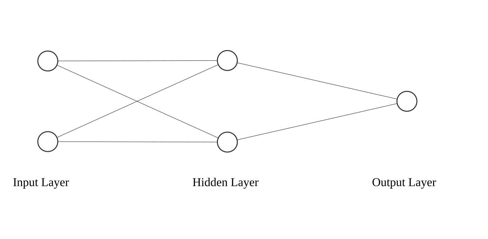
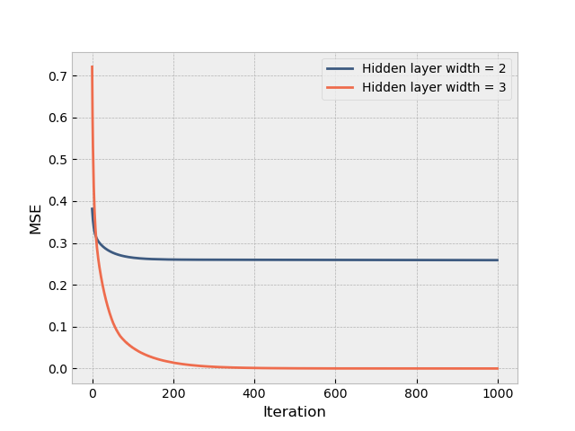






  
    
  
  
    
  
  
    
  


In the <a href={{nnPost}}>previous post</a> we briefly discussed neural networks and showed how they can be used to solve non-linear problems like the XOR problem. While we covered a solution for the XOR problem, we didn't cover how the weights of such a network can be derived. 

## The network

Lets say we again have the neural network that we used to solve the XOR problem. This network had an input layer with two nodes, one hidden layer with two nodes combined with the ReLU activation function and finally an output layer with one node and no activation function.

<div class="img-container">

</div>

The output $a^{(l)}$ of each layer $l$ is defined as follows:

$$ a^{(1)} = g(W^{(1)T}x + b^{(1)}) $$

$$ a^{(2)} = \hat{y} = W^{(2)}a^{(1)} + b^{(2)} $$

## Finding the optimal weights using the MLE

Similar to other Machine Learning models discussed, we can use the MLE and its gradient to find suitable weights.
We will treat this problem as a regression problem, and therefore we can use the MSE as our loss function.

$$ MSE = \frac{1}{n} \sum_{i=1}^n (y_i - \hat{y}_i)^2 $$

The optimization algorithm we will use later on, will process the data samply by sample. 
Therefore we will use the MSE per sample as our loss function. We scale by $1/2$ to make it easier to work with.

$$ L = \frac{1}{2} (y - \hat{y})^2 $$

## The backpropagation algorithm

Our goal is to find the derivatives of $\frac{\partial L}{\partial W^{(l)}}$ and $\frac{\partial L}{\partial b^{(l)}}$ for each layer $l$. Since all of these weights and biases are part of a network of computations, we need to work backwards from the output layer to the input layer to find these derivatives. When doing so, we will make use of the chain rule.  This is also known as **backpropagation**.

Let us first look at the derivative of the loss with respect to the output.

$$ \frac{\partial L}{\partial \hat{y}} =  \frac{\partial}{\partial \hat{y}} \left[ \frac{1}{2} (y - \hat{y})^2 \right] = \hat{y} - y $$

We can now use the chain rule to find the next derivative: the derivative of the loss with respect to the output layers' weights.

$$ \frac{\partial L}{\partial W^{(2)}} = \frac{\partial L}{\partial \hat{y}} \frac{\partial \hat{y}}{\partial W^{(2)}} = ( \hat{y} - y ) \cdot W^{(2)} $$

And we can do the same for the bias.

$$ \frac{\partial L}{\partial b^{(2)}} = \frac{\partial L}{\partial \hat{y}} \frac{\partial \hat{y}}{\partial b^{(2)}} = ( \hat{y} - y ) \cdot 1 $$

To move further back into the network we find the derivative of the output of the hidden layer.

$$ \frac{\partial L}{\partial a^{(1)}} = \frac{\partial L}{\partial \hat{y}} \frac{\partial \hat{y}}{\partial a^{(1)}} = ( \hat{y} - y ) \cdot W^{(2)} $$

Since the hidden layer applies an activation function, we need to find the derivative of this function as well, before we can find the derivative of the loss with respect to the weights.

$$
g(z) = \operatorname{ReLU}(z) = 
\begin{cases} 
0 & \text{if } z < 0, \\  \\
z & \text{if } z \ge 0 
\end{cases}
$$

$$
g'(z) = \operatorname{ReLU'}(z) = 
\begin{cases} 
0 & \text{if } z < 0, \\  \\
1 & \text{if } z \ge 0 
\end{cases}
$$

Using this we can find the derivative of the hidden layer before the activation function was applied, lets call this $\frac{\partial L}{\partial z^{(1)}}$. We use a Hadamard product as $g'(z)$ is applied element-wise to $z^{(1)}$.

$$ \frac{\partial L}{\partial z^{(1)}} = \frac{\partial L}{\partial \hat{y}} \frac{\partial \hat{y}}{\partial a^{(1)}} \frac{\partial a^{(1)}}{\partial z^{(1)}} = \frac{\partial L}{\partial a^{(1)}} \frac{\partial}{\partial z^{(1)}} \left[ g(z^{(1)}) \right] = ( \hat{y} - y ) \cdot W^{(2)} \odot g'(z^{(1)}) $$

Now we can find the derivative of the loss with respect to the weights and biases.

$$ \frac{\partial L}{\partial W^{(1)}} = \frac{\partial L}{\partial \hat{y}} \frac{\partial \hat{y}}{\partial a^{(1)}} \frac{\partial a^{(1)}}{\partial z^{(1)}} \frac{\partial z^{(1)}}{\partial W^{(1)}} = ( \hat{y} - y ) \cdot W^{(2)} \odot g'(z^{(1)}) \cdot x $$

$$ \frac{\partial L}{\partial b^{(1)}} = \frac{\partial L}{\partial \hat{y}} \frac{\partial \hat{y}}{\partial a^{(1)}} \frac{\partial a^{(1)}}{\partial z^{(1)}} \frac{\partial z^{(1)}}{\partial b^{(1)}} = ( \hat{y} - y ) \cdot W^{(2)} \odot g'(z^{(1)}) \cdot 1 $$

## Stochastic Gradient Descent

Now that we have found the derivative of the loss with respect to the weights and biases, we can use gradient descent to find suitable weights. While regular gradient descent would calculate the gradient with respect to the full dataset, **Stochastic Gradient Descent** will only calculate the gradient with respect to a single datapoint. This approach is more suitable for larger datasets, and also adds sone randomness into the optimization process.

For the network described above, we will use the following formulas ot update the weights and biases. Here, $\alpha$ is the learning rate.

$$ W^{(i)} = W^{(i)} - \alpha \frac{\partial L}{\partial W^{(i)}} $$
$$ b^{(i)} = b^{(i)} - \alpha \frac{\partial L}{\partial b^{(i)}} $$


## Python implementation

Again we define the XOR dataset.

```python
X = np.array([[0, 0],
              [0, 1],
              [1, 0],
              [1, 1]])

y = np.array([[0], 
              [1], 
              [1], 
              [0]])
```

And then define the layers of the network and their weights.

```python

# Hidden layer 1 (2 inputs, 2 nodes)
W_h1 = np.random.randn(2, 2)
b_h1 = np.zeros(layer_width)

# Output layer (2 inputs, 1 output)
W_o = np.random.randn(2,1)
b_o = np.zeros(1)
```

We define a forward and backward propagation using the formulas we derived above.

```python
def forward_pass(x, W_h1, b_h1, W_o, b_o):
    z1 = np.dot(x, W_h1) + b_h1
    h1 = relu(z1)
    y_hat = np.dot(h1, W_o) + b_o
    return y_hat, h1, z1


def backward_pass(x, y_true, y_hat, h1, z1, W_o):
    # Output layer gradients
    gradient_y = y_hat - y_true
    dW_o = np.dot(h1.T, gradient_y)
    db_o = gradient_y[0]

    # Hidden layer gradients
    gradient_h1 = np.dot(gradient_y, W_o.T)
    gradient_z_h1 = gradient_h1 * relu_gradient(z1)
    dW_h1 = np.dot(x.T, gradient_z_h1)
    db_h1 = gradient_z_h1[0]

    return dW_h1, db_h1, dW_o, db_o
```

Using these functions, we can now train the network. Since we are using SGD, we will loop over all the training samples and update the weights based on each sample. Once we reached the end of the dataset, we will will start another iteration.

```python
learning_rate = 0.01

for iteration in range(10000):
    y_hats = np.array([])
    for idx in range(X.shape[0]):
        x = X[idx : idx + 1]
        y_true = y[idx : idx + 1]
    
        # 1. Forward Pass
        y_hat, h1, z1 = forward_pass(x, W_h1, b_h1, W_o, b_o)
        y_hats = np.append(y_hats, y_hat)
    
        # 2. Backward Pass
        dW_h1, db_h1, dW_o, db_o = backward_pass(x, y_true, y_hat, h1, z1, W_o)
    
        # 3. Parameter Updates
        W_o -= dW_o * learning_rate
        b_o -= db_o * learning_rate
        W_h1 -= dW_h1 * learning_rate
        b_h1 -= db_h1 * learning_rate
```

Interestingly enough, the weights of our network do not converge to the optimal solution, but instead converge to a local minimum. When we increase the number of nodes in the hidden layer, we will see that the weights converge to the optimal solution.


<div class="img-container">

</div>


A Jupyter notebook containing the full code can be found <a href="/files/notebook_backprop.ipynb" download>here</a>.
