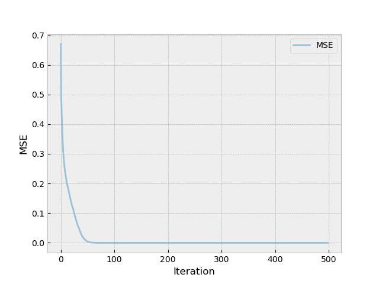






  
    
  
  
    
  
  
    
  


Last post we discussed <a href={{backpropPost}}>backpropagation</a> and showed how it can be used to find the optimal weights for a neural network. In this post we manually defined the network and calculated all the derivatives of the loss function with respect to the weights and biases. While this is a valid approach, it does not scale well to larger networks.
In this post we will discuss how popular libraries such as TensorFlow and PyTorch approach this problem. Finally, we will implement a minimal library that has a PyTorch-like API.

```python
    model = Sequential(
        Linear(2, 4),
        ReLU(),
        Linear(4, 1),
    )
```


## Graph Computation

Most deep learning libraries rely on a graph computation model to describe the computation of a neural network. If we take the model $ y = XW + b $ as an example, we can represent it as the computation graph below.

<div class="img-container">
<svg width="100%" viewBox="0 0 680 240" role="img" xmlns="http://www.w3.org/2000/svg">

  <defs>
    <marker id="arrow" viewBox="0 0 10 10" refX="8" refY="5" markerWidth="6" markerHeight="6" orient="auto-start-reverse">
      <path d="M2 1L8 5L2 9" fill="none" stroke="#888780" stroke-width="1.5" stroke-linecap="round" stroke-linejoin="round"/>
    </marker>
  </defs>

  <!-- Input nodes -->
  <g>
    <rect x="28" y="42" width="72" height="40" rx="6" fill="#E1F5EE" stroke="#0F6E56" stroke-width="1"/>
    <text x="64" y="62" text-anchor="middle" dominant-baseline="central" font-family="system-ui, sans-serif" font-size="15" font-weight="600" fill="#085041">X</text>
  </g>
  <g>
    <rect x="28" y="100" width="72" height="40" rx="6" fill="#E1F5EE" stroke="#0F6E56" stroke-width="1"/>
    <text x="64" y="120" text-anchor="middle" dominant-baseline="central" font-family="system-ui, sans-serif" font-size="15" font-weight="600" fill="#085041">W</text>
  </g>
  <g>
    <rect x="28" y="158" width="72" height="40" rx="6" fill="#E1F5EE" stroke="#0F6E56" stroke-width="1"/>
    <text x="64" y="178" text-anchor="middle" dominant-baseline="central" font-family="system-ui, sans-serif" font-size="15" font-weight="600" fill="#085041">b</text>
  </g>

  <!-- Multiply op -->
  <g>
    <circle cx="210" cy="84" r="24" fill="#F1EFE8" stroke="#888780" stroke-width="1"/>
    <text x="210" y="84" text-anchor="middle" dominant-baseline="central" font-family="system-ui, sans-serif" font-size="18" font-weight="500" fill="#444441">×</text>
  </g>

  <!-- U intermediate node -->
  <g>
    <rect x="270" y="64" width="72" height="40" rx="6" fill="#E1F5EE" stroke="#0F6E56" stroke-width="1"/>
    <text x="306" y="84" text-anchor="middle" dominant-baseline="central" font-family="system-ui, sans-serif" font-size="15" font-weight="600" fill="#085041">U</text>
  </g>

  <!-- Add op -->
  <g>
    <circle cx="460" cy="120" r="24" fill="#F1EFE8" stroke="#888780" stroke-width="1"/>
    <text x="460" y="120" text-anchor="middle" dominant-baseline="central" font-family="system-ui, sans-serif" font-size="18" font-weight="500" fill="#444441">+</text>
  </g>

  <!-- Output node -->
  <g>
    <rect x="572" y="100" width="72" height="40" rx="6" fill="#EEEDFE" stroke="#534AB7" stroke-width="1"/>
    <text x="608" y="120" text-anchor="middle" dominant-baseline="central" font-family="system-ui, sans-serif" font-size="15" font-weight="600" fill="#3C3489">y</text>
  </g>

  <!-- Arrows -->
  <line x1="100" y1="62" x2="186" y2="76" stroke="#888780" stroke-width="1.5" marker-end="url(#arrow)"/>
  <line x1="100" y1="120" x2="186" y2="96" stroke="#888780" stroke-width="1.5" marker-end="url(#arrow)"/>
  <line x1="234" y1="84" x2="270" y2="84" stroke="#888780" stroke-width="1.5" marker-end="url(#arrow)"/>
  <line x1="342" y1="90" x2="436" y2="113" stroke="#888780" stroke-width="1.5" marker-end="url(#arrow)"/>
  <line x1="100" y1="178" x2="436" y2="129" stroke="#888780" stroke-width="1.5" marker-end="url(#arrow)"/>
  <line x1="484" y1="120" x2="572" y2="120" stroke="#888780" stroke-width="1.5" marker-end="url(#arrow)"/>
</svg>
</div>


As we covered in the previous post, backpropagation finds the derivatives of the loss function with respect to the weights and biases by traversing the graph backwards. This can be applied to the graph above as well. 


<div class="img-container">
<svg width="100%" viewBox="0 0 680 240" role="img" xmlns="http://www.w3.org/2000/svg">

  <!-- Input nodes -->
  <g>
    <rect x="28" y="42" width="72" height="40" rx="6" fill="#E1F5EE" stroke="#0F6E56" stroke-width="1"/>
    <text x="64" y="62" text-anchor="middle" dominant-baseline="central" font-family="system-ui, sans-serif" font-size="15" font-weight="600" fill="#085041">X</text>
  </g>
  <g>
    <rect x="28" y="100" width="72" height="40" rx="6" fill="#E1F5EE" stroke="#0F6E56" stroke-width="1"/>
    <text x="64" y="120" text-anchor="middle" dominant-baseline="central" font-family="system-ui, sans-serif" font-size="15" font-weight="600" fill="#085041">W</text>
  </g>
  <g>
    <rect x="28" y="158" width="72" height="40" rx="6" fill="#E1F5EE" stroke="#0F6E56" stroke-width="1"/>
    <text x="64" y="178" text-anchor="middle" dominant-baseline="central" font-family="system-ui, sans-serif" font-size="15" font-weight="600" fill="#085041">b</text>
  </g>

  <!-- Multiply op -->
  <g>
    <circle cx="210" cy="84" r="24" fill="#F1EFE8" stroke="#888780" stroke-width="1"/>
    <text x="210" y="84" text-anchor="middle" dominant-baseline="central" font-family="system-ui, sans-serif" font-size="18" font-weight="500" fill="#444441">×</text>
  </g>

  <!-- U intermediate node -->
  <g>
    <rect x="270" y="64" width="72" height="40" rx="6" fill="#E1F5EE" stroke="#0F6E56" stroke-width="1"/>
    <text x="306" y="84" text-anchor="middle" dominant-baseline="central" font-family="system-ui, sans-serif" font-size="15" font-weight="600" fill="#085041">U</text>
  </g>

  <!-- Add op -->
  <g>
    <circle cx="460" cy="120" r="24" fill="#F1EFE8" stroke="#888780" stroke-width="1"/>
    <text x="460" y="120" text-anchor="middle" dominant-baseline="central" font-family="system-ui, sans-serif" font-size="18" font-weight="500" fill="#444441">+</text>
  </g>

  <!-- Output node -->
  <g>
    <rect x="572" y="100" width="72" height="40" rx="6" fill="#EEEDFE" stroke="#534AB7" stroke-width="1"/>
    <text x="608" y="120" text-anchor="middle" dominant-baseline="central" font-family="system-ui, sans-serif" font-size="15" font-weight="600" fill="#3C3489">y</text>
  </g>

  <!-- Arrows -->
  <line x1="100" y1="62" x2="186" y2="76" stroke="#888780" stroke-width="1.5" marker-start="url(#arrow)"/>
  <text x="148" y="60" text-anchor="middle" font-family="sans-serif" font-size="14">∂U/∂X</text>

  <line x1="100" y1="120" x2="186" y2="96" stroke="#888780" stroke-width="1.5" marker-start="url(#arrow)"/>
  <text x="148" y="130" text-anchor="middle" font-family="sans-serif" font-size="14">∂U/∂W</text>

  <line x1="234" y1="84" x2="270" y2="84" stroke="#888780" stroke-width="1.5" marker-start="url(#arrow)"/>

  <line x1="342" y1="90" x2="436" y2="113" stroke="#888780" stroke-width="1.5" marker-start="url(#arrow)"/>
  <text x="395" y="90" text-anchor="middle" font-family="sans-serif" font-size="14">∂U/∂y</text>

  <line x1="100" y1="178" x2="436" y2="129" stroke="#888780" stroke-width="1.5" marker-start="url(#arrow)"/>
  <text x="255" y="145" text-anchor="middle" font-family="sans-serif" font-size="14">∂b/∂y</text>

  <line x1="484" y1="120" x2="572" y2="120" stroke="#888780" stroke-width="1.5" marker-start="url(#arrow)"/>
  <text x="530" y="110" text-anchor="middle" font-family="sans-serif" font-size="14">∂y/∂y</text>
</svg>
</div>

By following the graph above, we can find the derivative of the output with respect to the weights and biases. For the weights $W$ we for example find that:

$$\frac{\partial y}{\partial W} = \frac{\partial y}{\partial y} \frac{\partial y}{\partial U} \frac{\partial U}{\partial W} = 1 \cdot 1 \cdot X$$

While this is a somewhat simplified view, on a high level this is what most deep learning libraries do.
In the next section we will implement such a library and provide more details along the way.

## Building a Deep Learning Library

To build such a library, we will start from the most basic building block: the tensor. Once we have defined this tensor, we will extend it so it suits our needs, and finally use it to build higher level abstractions, like layers and finally a whole neural network.

### Tensors

For now, our Tensor class will just be a a simple wrapper around a numpy array. We will add the ability to perform basic operations on the tensor, like addition and multiplication. We will also add the relu method

```python
class Tensor:
    def __init__(self, data):
        self.data = np.asarray(data, dtype=np.float64)

    def __repr__(self):
        return str(self.data)

    def __add__(self, other):
        out = Tensor(self.data + other.data)
        return out

    def __matmul__(self, other):
        out = Tensor(self.data @ other.data)
        return out
```

To verify that this works, we try some basic operations.

```python
a = Tensor([[1,1],[1,1]])
b = Tensor([[2,2],[2,2]])

>>> a + b
[[3. 3.]
 [3. 3.]]

>>> a @ b
[[4. 4.]
 [4. 4.]]
```

We can also use this to define a simple hidden layer without any activation function.

```python
x = Tensor([[1, 2]])
w = Tensor([[2, 1], [1, 2]])
b = Tensor([[1, 1]])

y = x @ w + b

>>> y
[[5. 6.]]
```

### Backpropagation

In order to implement backpropagation, we will need two things: (1) a way to define the derivative of each operation, and (2) a way to track which nodes are connected to which other nodes.

For the first part, we will attach a _back method to the Tensor class that will set the gradient of the tensor. This method depends on the operation that is being performed on the tensor. When _back is called on the output of a addition, it will ensure that the input tensors are updated using the gradient of the output. 

```python

class Tensor:
    def __init__(self, data):
        ...
        self.grad = np.zeros_like(self.data)
        self.back = lambda: None
    
    def __add__(self, other):
        ...
        def _back():
            self.grad  += _unbroadcast(out.grad, self.data.shape)
            other.grad += _unbroadcast(out.grad, other.data.shape)
        out._back = _back
        ...


    def __matmul__(self, other):
        ...
        def _back():
            self.grad  += out.grad @ other.data.T
            other.grad += self.data.T @ out.grad
        out._back = _back
        ...
        return out
```

We can can test this out on a simple calculation. As the derivative of $y=XW$ w.r.t $W$ is just $X$, we can see that the output is correct. The shape is different because we are broadcasting to match the shape of the Tensor.

```python
x = Tensor([[3,3]])
w = Tensor([[2,2],[2,2]])

y = x @ w

# Set gradient to 1s as y is the output.
y.grad = np.ones_like(y.data)

y._back()

>>> w.grad
[[3. 3.]
 [3. 3.]]
```

Now the only thing that remains, is ensuring that the gradient is propagated all the way back to the input. To do this, we will need to keep track of which nodes are connected to which other nodes. For this we will add a _children attribute to the Tensor class. We also ensure that each operation sets the children of the output Tensor.

```python
class Tensor:
    def __init__(self, data):
        ...
        self._children = []

    def __add__(self, other):
        ...
        out._children = [self, other]
        ...

    def __matmul__(self, other):
        ...
        out._children = [self, other]
        ...
```

With this, we can now propagate the gradient back to the input. For this will define a backward method on the Tensor class.
This method will first do a reverse topological sort of the graph, so that we can visit the nodes in the correct order. After this it will visit each node in this order, and call the _back method on each node so that the gradient is calculated.

```python
class Tensor:
    ...
    def _topo_sort(self):
        topo = []
        def visit(v):
            if v not in topo:
                for child in v._children:
                    visit(child)
                topo.append(v)
        visit(self)
        return topo

    def backward(self):
        self.grad = np.ones_like(self.data)
        for v in reversed(self._topo_sort()):
            v._back()
    ...
```

Now lets try this out on a our simple hidden layer.

```python
x = Tensor([[3, 3]])
w = Tensor([[2, 2], [2, 2]])
b = Tensor([[4, 4]])

y = x @ w + b
y

y.backward()

>>> w.grad
[[3. 3.]
 [3. 3.]]
>>> b.grad
[[1. 1.]]
```

Now that we have backpropagation sorted out, lets add some abstractions to make it easier to define networks.

### Building a full network

What's a neural network without activation functions? Before we define the network, lets first define a ReLU activation function. Similar to the operations, we will define a ReLU method on the Tensor class.

```python

class Tensor:
    ...
    def relu(self):
        out = Tensor(np.maximum(0, self.data))
        def _back():
            self.grad += (out.data > 0) * out.grad
        out._back = _back
        out._children = [self]
        return out
    ...
```

Now in order to define a network, we start with defining fully connected (linear) layer. 
This layer takes in the Tensors from the previous layer and applies a linear transformation to it.

```python
class Linear:
    def __init__(self, in_features: int, out_features: int):
        self.W = Tensor(np.random.randn(out_features, in_features))
        self.b = Tensor(np.zeros((1, out_features)))

    def __call__(self, x: Tensor) -> Tensor:
        return x @ self.W + self.b

    def parameters(self) -> list:
        return [self.W, self.b]
```

Now to allow for combining this with an activation function, we will define a similar class for ReLU.

```python
class ReLU:
    def __call__(self, x): return x.relu()
```

And finally, we define a sequential class that allows us to combine multiple layers.

```python
class Sequential:
    def __init__(self, *layers):
        self.layers = layers

    def __call__(self, x: Tensor) -> Tensor:
        for layer in self.layers:
            x = layer(x)
        return x

    def parameters(self) -> list:
        params = []
        for layer in self.layers:
            if hasattr(layer, 'parameters'):
                params.extend(layer.parameters())
        return params
```

Now we can define a network like we proposed in the introduction of the post.

```python
    model = Sequential(
        Linear(2, 4),
        ReLU(),
        Linear(4, 1),
    )
```
### Solving the XOR problem using our library

Now in order to train our model we will again need a stochastic gradient descent algorithm.
Similar to previous blog posts, we will calculate the MSE for each training sample and then update the weights using the gradient of the loss function.

```python
for epoch in range(1, 500):
        for x, y in zip(X.data, Y.data):
            inp    = Tensor(x[None])
            target = Tensor([[y]])
            pred   = model(inp)
            mse   = ((pred - target) * (pred - target))

            # Clear gradients from previous epoch.
            model_params = model.parameters()
            for p in model_params:
                p.grad = np.zeros_like(p.data)

            # Calculate new gradients.
            mse.backward()

            # Update weights.
            for p in model_params:
                p.data -= 0.05 * p.grad
```

When we again apply this to the XOR problem, we can see that the weights converge to the optimal solution.

<div class="img-container">

</div>


A Jupyter notebook containing the full code can be found <a href="/files/notebook_dl_library.ipynb" download>here</a>.


