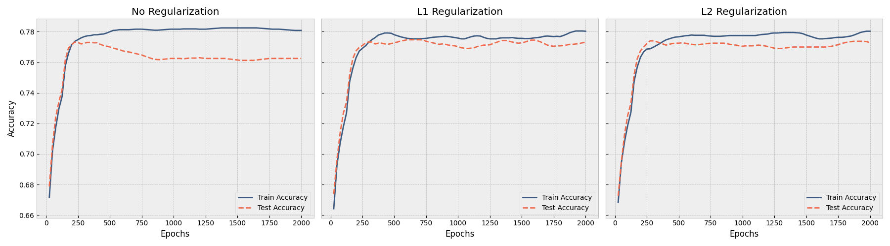






  
    
  
  
    
  
  
    
  


In an earlier post on <a href={{ridgeRegressionPost}}>Ridge Regression</a> we showed that once models get more complex, there is a chance that the model will overfit the training data. We also showed that this can be prevented by adding a pentalty term to the loss function that penalizes the model for having large weights. In this post will discuss these penalties in more detail, and show how they affect the training of our Neural Network.

## L2 Regularization

As discussed before, Ridge regression is basically a linear model with a L2 penalty term added to the loss function. Again, we can define the regularized loss function $\tilde{J}(w)$ as follows:

$$\tilde{J}(w) =  J(w) + \frac{\lambda}{2} \| w \|^2_2$$

In this section we will study the effect of L2 regularization on the gradient and the optimal weights.
To do so, we will first define the gradient of the L2 regularized loss function $\tilde{J}(w)$ as follows:

$$\nabla_w \tilde{J}(w) = \nabla_w J(w) + \frac{\lambda}{2} \nabla_w \| w \|^2_2$$

$$ = \nabla_w J(w) + \lambda w$$

<!-- ### How does L2 regularization affect the gradient updates?

We can investigate the effect of this penalty term by looking at the gradient of the loss function with respect to $w$.

$$\nabla_w \tilde{J}(w) = \nabla_w J(w) + \frac{\lambda}{2} \nabla_w \| w \|^2_2$$

$$ = \nabla_w J(w) + \lambda w$$

If we use this to update the weights using gradient descent, given learning rate $\epsilon$, we get the following update rule:

$$w \leftarrow w - \epsilon \left( \nabla_w J(w) + \lambda w \right)$$

Which is equivalent to

$$w \leftarrow w - \epsilon \nabla_w J(w) - \epsilon \alpha w$$

and

$$w \leftarrow (1 - \epsilon \lambda) w - \epsilon \nabla_w J(w)$$

Here $w - \epsilon \nabla_w J(w)$ is just the regular gradient descent update rule without any regularization. But the diffrence is that we are now multiplying the initial weights by $1 - \epsilon \lambda$ term. As this term is usually slightly smaller than $1$, this means that the weights are being shrunk before a weight update is applied.  -->

<!-- ### How does L2 regularization affect the overall training of a Neural Network? -->

<!-- Now that we have taken a look at the effect of L2 regularization on a single update step, lets look at how this affects the overall training of a Neural Network. For that we will need to approximate the gradient of the L2 regularized loss function.

$$\nabla_w \tilde{J}(w) = \nabla_w J(w) + \lambda w$$ -->

The derrivative of the penalty term is clear. To find $\nabla_w J(w)$ we will perform a taylor approximation around the optimal weights of the unregularised loss $w^*$.

$$ \hat{J}(w) = J(w^{\star}) + \nabla J(w^{\star}) \cdot (w - w^{\star}) + \frac{1}{2}(w - w^{\star})^T H(w - w^{\star}) $$

As the gradient of the loss function at $w^{\star}$ is zero, we can remove the first order term in the taylor expansion.

$$ \hat{J}(w) = J(w^{\star}) + \frac{1}{2}(w - w^{\star})^T H(w - w^{\star}) $$

Now we can look at the gradient of the approximated loss function with respect to $w$

$$ \nabla_w \hat{J}(w) = H(w - w^{\star}) $$

and combine it with the gradient of the L2 loss function into

$$ \nabla_w \tilde{J}(w) = H(w - w^{\star}) + \lambda w$$

Setting the gradient to zero gives us the optimal weights $\tilde{w}$ for the L2 regularized loss function.

$$ \tilde{w} = \left( H + \lambda I \right)^{-1} \lambda w^{\star}$$

It's clear that when $\lambda$ gets smaller, the optimal weights $\tilde{w}$ get closer to the optimal weights $w^{\star}$ for the unregularised case.

One can decompose the Hessian matrix $H$ into $Q\Lambda Q^T$ where $\Lambda$ is a diagonal matrix with the eigenvalues of $H$. Doing so gives the following definition of the optimal weights.

$$ \tilde{w} = Q \left( \Lambda + \lambda I \right)^{-1} \Lambda Q^T w^{\star}$$

We can see that the regularization adds a constant $\lambda$ to the eigenvalues of $H$. Further derivation shows that each weight $w_i$ is scaled by factor $\frac{\lambda_i}{\lambda_i + \lambda}$. When $\lambda_i$ is big, the factor gets close to $1$ and almost no scaling is applied. However, when $\lambda_i$ is small, the scaling factor gets small, and therefore the scaled eigenvalue as well. This basically highlights a nice property of L2 regularization: It shrinks unimportant eigenvalues (and therefore also shrinks unimportant properties of the dataset), while leaving the important ones mostly untouched.


## L1 Regularization

We can take the same approach for L1 regularization, and study the effect of this penalty term on the gradient and the optimal weights.

L1 regularization is defined as follows:

$$\tilde{J}(w) =  J(w) + \lambda \| w \|_1  $$

$$ = J(w) + \lambda \sum_{i=1}^n |w_i|$$

Similar to L2 regularization, we can investigate the effect of this penalty term by looking at the gradient of the loss function with respect to $w$.

$$ \nabla_w \tilde{J}(w) = \nabla_w J(w) + \lambda \nabla_w \left( \sum_{i=1}^n |w_i| \right)$$

To find the gradient of the absolute value sum, we need to look at the partial derivative of each $w_i$.

$$ \frac{\partial}{\partial w_i} |w_i| = \begin{cases} 1 & \text{if } 1 > 0 \\ -1 & \text{otherwise} \end{cases}$$

Clearly, this basically is the sign of $w_i$.

$$ \frac{\partial}{\partial w_i} |w_i| = sign(w_i)$$

Therefore the full gradient of $\tilde{J}(w)$ is

$$ \nabla_w \tilde{J}(w) = \nabla_w J(w) + \lambda sign(w)$$

Again, we use the taylor series approximation of $\nabla_w J(w)$ and up with

$$ \nabla_w \tilde{J}(w) = H(w - w^{\star}) + \lambda sign(w)$$

We set this equal to zero to find the optimal weights $\tilde{w}$ for the L1 regularized loss function.

$$ H(w - w^{\star}) + \lambda sign(w) = 0$$

$$ \tilde{w} = w^{\star} - \lambda H^{-1} sign(w)$$

When assuming that $H$ is diagonal, the formula for a specific weight $w_i$ becomes

$$ \tilde{w}_i = w^{\star}_i - \frac{\lambda}{H_i} sign(\tilde{w_i}) $$

<!-- To get rid of the sign function, we can take into account the case where $w_i$ is positive or negative.

$$ \begin{cases} \tilde{w}_i > 0 & \tilde{w}_i = w^{\star}_i - \frac{\lambda}{H_i} \\ \tilde{w}_i < 0 & \tilde{w}_i = w^{\star}_i + \frac{\lambda}{H_i} \end{cases} $$ -->

Which can be combined into 

$$ \tilde{w}_i = sign(w^{\star}_i) max(0, |w^{\star}_i| - \frac{\lambda}{H_i}) $$

This formula allows us to study the effect of L1 regularization on the optimal weights. We can break this down into two cases: $|w^{\star}|$ is bigger than $\frac{\lambda}{H_i}$ and the case where $|w^{\star}|$ is smaller than $\frac{\lambda}{H_i}$. For the first case, it's clear that this simply results in $|w^{\star}|$ minus $\frac{\lambda}{H_i}$. However, for the second case, we can see that the we actually end up with zero.

This basically explains the effect of L1 regularization. It sets weights with low curvature to zero, while keeping the other weights (mostly) unchanged. Since we end up with a weight matrix that likely has some zero values, L1 regularization basically enforces sparsity in the weight matrix. This is of course very different from L2 regularization, where sparsity is not enforced.


## Studying the effect of L1 and L2 regularization in Python

In this section we will study the effect of both regularization techniques on an actual Neural Network.
We will purposefully use a simple dataset with a overparameterized model.


For this we will use the `make_circles` dataset generation tool that sklearn provides. The generated dataset consists of 
datapoints from two circles, one inside the other. The goal is to separate the two circles. Below we generate the dataset and split it into training and test data.

```python
from sklearn.datasets import make_circles
from sklearn.model_selection import train_test_split
from sklearn.preprocessing import StandardScaler

X, y = make_circles(n_samples=2000, noise=0.33, factor=0.5, random_state=42)

X_train, X_test, y_train, y_test = train_test_split(
    X, y, test_size=0.4, random_state=42
)

scaler = StandardScaler()
X_train = scaler.fit_transform(X_train)
X_test = scaler.transform(X_test)

X_train = torch.FloatTensor(X_train)
X_test = torch.FloatTensor(X_test)
y_train = torch.LongTensor(y_train)
y_test = torch.LongTensor(y_test)
```

While a rather simple neural network should be able to separate the two circles, we will use a more complex network to better showcase the effect of regularization. We do this using a model with one hidden layer that has 500 nodes. To keep things simple, we will use ReLU activation functions, Cross Entropy as the loss function and SGD as the optimizer.

```python
model = nn.Sequential(
    nn.Linear(2, 500),
    nn.ReLU(),
    nn.Linear(500, 500),
    nn.ReLU(),
    nn.Linear(500, 2)
)

criterion = nn.CrossEntropyLoss()
optimizer = optim.SGD(model.parameters(), lr=0.01)
```

Finally we perform the training of the model. Note that we have added two cases for the regularization term.

```python
 for epoch in range(epochs):
        model.train()
        outputs = model(X_train)
        loss = criterion(outputs, y_train)
        
        # Apply specific regularization penalty
        if config == 'L1':
            l1_penalty = sum(p.abs().sum() for p in model.parameters())
            loss = loss + (0.004 * l1_penalty)
        elif config == 'L2':
            l2_penalty = sum((p ** 2).sum() for p in model.parameters())
            loss = loss + (0.050 * l2_penalty)
        
        optimizer.zero_grad()
        loss.backward()
        optimizer.step()
```

We train both the non-regularized, L1 and L2 models for 2000 epochs. To keep consistent, we use the exact same dataset, and initial weights for all three models. Along the way we track both the training and test accuracy. Especially the test accuracy will help us understand wether our model overfits the data. The results can be found in the graph below.

<div class="img-container-big">

</div>

We see that the model without regularization finds good weights around 250 epochs. However, when we continue training this model, we see the training accuracy improving further, while our test accuracy starts to drop. This is obviously because the model is overfitting the training data.

To counter this, we can use either L1 or L2 regularization. In both the 2nd and the 3rd graph we see that the model again finds good weights around 250 epochs. However, this time, the continued training does not degrade our test performance. Both L1 and L2 regularization push the model towards a simpler solution, preventing the model from overfitting. Both the test and train accuracy of these regularized models seems to fluctuate more than the non-regularized model.

An analysis of the final weights of each model can be found in the table below.

<table>
  <thead>
    <tr>
      <th>Regularization</th>
      <th>L1 Norm</th>
      <th>L2 Norm</th>
      <th>Sparsity</th>
    </tr>
  </thead>
  <tbody>
    <tr>
      <td><strong>None</strong></td>
      <td>6193.7129</td>
      <td>20.5657</td>
      <td>0.23%</td>
    </tr>
    <tr>
      <td><strong>L1</strong></td>
      <td>451.7051</td>
      <td>13.4620</td>
      <td>99.12%</td>
    </tr>
    <tr>
      <td><strong>L2</strong></td>
      <td>922.3664</td>
      <td>3.1774</td>
      <td>1.60%</td>
    </tr>
  </tbody>
</table>

The information in the table confirms the properties of L1 and L2 regularization we described above. The model without regularization has high norms and almost no sparsity. L1 on the other hand has a slightly lower L2 norm, but on the other hand has very high sparsity, only 1.6% of the weights are non-zero. The L2 model clearly has the smallest L2 norm, but also seems to add some sparsity compared to the unregularized model.